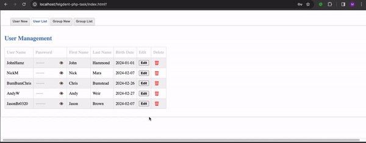
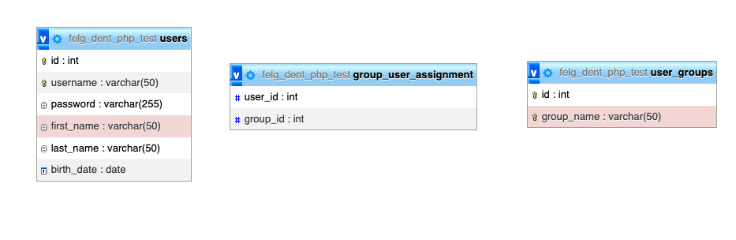

<h3 align="center">Simple User and Groups Manager</h3>

  <p align="center">
    Web application in Vanilla PHP and jqeury with custom css.
    
  </p>


<!-- TABLE OF CONTENTS -->
<details>
  <summary>Table of Contents</summary>
  <ol>
    <li>
      <a href="#about-the-project">About The Project</a>
      <ul>
        <li><a href="#built-with">Built With</a></li>
      </ul>
    </li>
    <li>
      <a href="#getting-started">Getting Started</a>
      <ul>
        <li><a href="#prerequisites">Prerequisites</a></li>
        <li><a href="#installation">Installation</a></li>
      </ul>
    </li>
    <li><a href="#usage">Usage</a></li>
        <ul>
            <li><a href="#functions">Functions</a></li>       
            <li><a href="#endpoints">Endpoints</a></li>
        </ul>
    <li><a href="#database">Database</a></li></li>
    <li><a href="#ideas">Ideas</a></li></li>
    <li><a href="#code">Code</a></li></li>
    <li><a href="#license">License</a></li>
  </ol>
</details>


<!-- ABOUT THE PROJECT -->
## About The Project



This simple app is recruitment task solution - original requirements in Docs/requirements.md 

<p align="right">(<a href="#readme-top">back to top</a>)</p>


### Built With

* ![Php-url]
* [![JQuery][JQuery.com]][JQuery-url]

<p align="right">(<a href="#readme-top">back to top</a>)</p>


<!-- GETTING STARTED -->
## Getting Started


### Prerequisites

* mysql
* apache (or other http server)
* php 7.4


### Installation


1. Clone the repo to desired folder in apache www directory (or other)
   ```sh
   git clone https://github.com/github_username/repo_name.git
   ```
2. Create database and user in mysql

3. Create database structure
   ```sh
   mysql -u username -p database_name < create-db.sql
   ```
4. Enter your database credentials in `config.php`
   ```js
    define('DB_HOST', 'localhost');
    define('DB_USER', 'user_name');
    define('DB_PASSWORD', '1234');
    define('DB_NAME', 'db_name');
   ```
   
5. Start apache (or other http server, below command may differ by system, it works on mac os)
   ```
   sudo apachectl start
   ```
6. (in case You copied it in apache www) and go to http://localhost/foldername 

<p align="right">(<a href="#readme-top">back to top</a>)</p>

## Usage

### Functions 

User management:
- add new user 
- delete user
- edit user
- add user to group
- show groups that user belong to

Group management:
- add new group
- delete group
- edit group
- show users that belong to group

### Endpoints
List of all endpoints:

url {POST data}

- server.php?action=**addUser** {username, password, firstName, lastName, birthDate}
- server.php?action=**getUsers** optional {groupID}
- server.php?action=**getUser** {userId}
- server.php?action=**editUser** {userId, username, password, firstName, lastName, birthDate}
- server.php?action=**addUserToGroup** {userId, groupId}
- server.php?action=**getUserGroups** {userId}
- server.php?action=**removeUser** {userId}
- server.php?action=**addGroup** {groupName}
- server.php?action=**getGroup** {groupId}
- server.php?action=**editGroup** {groupName, groupId}
- server.php?action=**getGroups**
- server.php?action=**removeGroup** {id}
- server.php?action=**removeUserFromGroup** {userId, groupId}

<p align="right">(<a href="#readme-top">back to top</a>)</p>

<!-- DATABASE -->
## DATABASE


<!-- IDEAS -->
## IDEAS
1. Authorization and authentication.

Web app or api like this should be protected by authorization and authentication. 

It could be realized by implementing simple login system (create Auth.php), create group Admins and put there users that will have access to app.

App could generate time token on login and store it in client web browser and server database - all requests will be available only by passing valid token. This involved both frontend and backend changes (add token to forms, create new column in users table to store token and expiry time)


<!-- CODEBASE -->
## CODEBASE

Vanilla PHP was requirement. Code is separated to folders:
src/
- **Builders**
- **Controllers**
- **Models**
- **Responses**
- **Validators**
- **server.php**

1. **Builders** - prepare object (return array with specific properties), run validation (validation could be moved to controllers)
2. **Controllers** - delegate action to proper model
3. **Models** - runs sql queries and returns results
4. **Response** - simple class to pack response data and http code to unified app response structure
5. **Validators** - validates input data, normalizes data
6. **server.php** - delegates http request to controllers

**BaseController.php** - provides method to pass $_POST data

**BaseModel.php** - mysqli 'db driver', It's not exactly driver, but it has impelemented basic sql queries linke select, insert, list etc.
<!-- LICENSE -->
## License

Distributed under the MIT License.

<p align="right">(<a href="#readme-top">back to top</a>)</p>


<!-- MARKDOWN LINKS & IMAGES -->
<!-- https://www.markdownguide.org/basic-syntax/#reference-style-links -->

[JQuery.com]: https://img.shields.io/badge/jQuery-0769AD?style=for-the-badge&logo=jquery&logoColor=white
[JQuery-url]: https://jquery.com
[PHP-url]: https://img.shields.io/badge/PHP-777BB4?style=for-the-badge&logo=php&logoColor=white